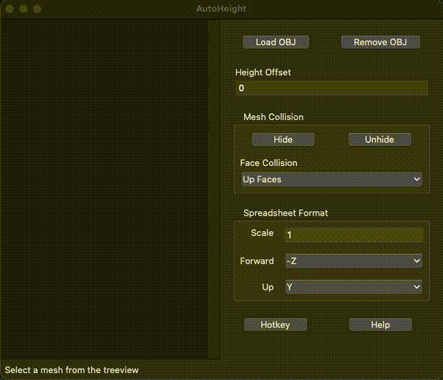

# AutoHeight

3D-point height calculator for spreadsheets. Bound to global hotkey `Ctrl + Alt + P` by default.

# Features
- Load multiple Wavefront OBJ files
- Simple Tkinter GUI
- Hide specific OBJs, OBJ objects and OBJ groups

# Requirements
- [Python 3](https://www.python.org/downloads/)
- [Tkinter 8.6+](https://tkdocs.com/tutorial/install.html)
- [NumPy](https://numpy.org/install/)
- [pynput](https://pypi.org/project/pynput/)

## pynput on Linux and Mac
Some [additional configuration](https://pynput.readthedocs.io/en/latest/limitations.html) may be required to run the script on these platforms.

 